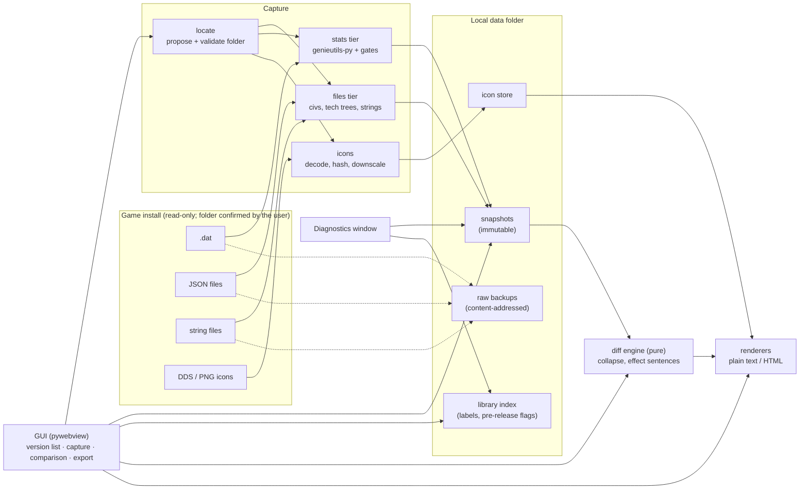
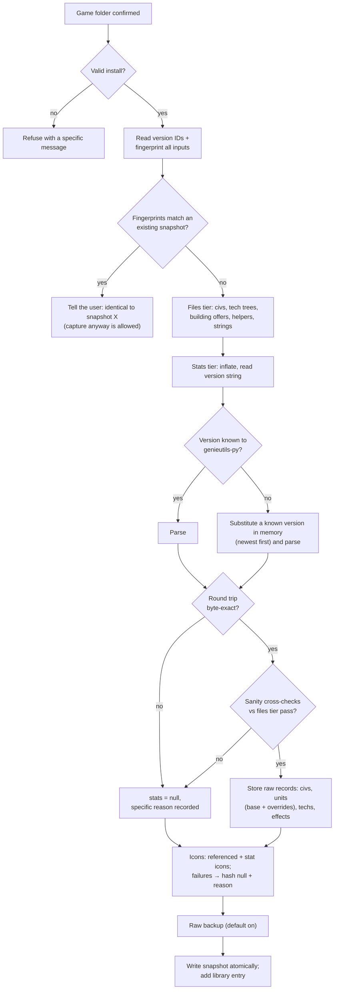

# Architecture

**Status: draft v2, 2026-09-15** (after the second review pass). It follows [decisions.md](../decisions.md).

Module names use the package name `patch_scout` (P-11). The implementation plans may adjust them.

## Overview



Two stages, fully separated (D-05):

1. **Capture** reads one install and writes one immutable snapshot, plus new entries in the icon store and raw backups.
2. **Diff** reads two snapshots and produces a change set. The GUI displays it, and the renderers export it.

There is **no CLI** (P-08, rejected). The GUI is the only interface; what a `verify` command would have shown is covered by the Diagnostics window. Tests call the Python API directly.

## Components

| Component (working module) | Responsibility | Depends on | Touches game files? |
|---|---|---|---|
| `patch_scout.locate` | Propose candidate install folders, validate a folder, read version identifiers and input fingerprints | stdlib, `winreg` | Read-only |
| `patch_scout.capture.files_tier` | Read `civilizations.json`, CivTechTrees, building offers, helpers into snapshot records | `snapshot` | Read-only |
| `patch_scout.capture.strings` | Parse key-value string files per language; log duplicates | — | Read-only |
| `patch_scout.capture.stats_tier` | Decompress the `.dat`, pick the layout (including the unknown-version fallback), parse, run the gates, store raw records | genieutils-py, `snapshot` | Read-only |
| `patch_scout.capture.gates` | Round trip and sanity cross-checks against the files tier | genieutils-py | No |
| `patch_scout.capture.icons` | Resolve icon paths (tech tree, emblems, unique units, stat icons), decode, hash, downscale | Pillow, `store` | Read-only |
| `patch_scout.snapshot` | Snapshot schema, (de)serialization, validation, migrations | stdlib | No |
| `patch_scout.store` | Snapshot files, library index, icon store, raw backups, export/import archives | `snapshot` | No |
| `patch_scout.diff` | `diff(old, new, rules) → ChangeSet`: matching, allowlist, per-civ collapse, effect sentences, change-volume check | `snapshot`, `i18n` | No |
| `patch_scout.report` | `ChangeSet → plain text / self-contained HTML` | `diff`, `store` (icons), `i18n` | No |
| `patch_scout.i18n` | Message catalogs for UI labels and report sentences; language fallback to English | stdlib | No |
| `patch_scout.gui` | pywebview window, Python↔JS API, frontend (including image export), Diagnostics window | everything above | No (goes through `capture`) |

**Dependency rules** (enforced in review, and by an import-linter check once code exists):

- **Only** `locate` and `capture.*` read game files. The GUI and the Diagnostics window never do (D-13).
- **Only** `capture.stats_tier` and `capture.gates` import `genieutils`. Library objects never leave those modules (D-05).
- `snapshot`, `diff` and `report` do **no I/O on game files** and don't import GUI code. `diff` is a pure function, which makes fixture-based testing possible.
- **No user-visible text hardcoded** in `diff`, `report` or the frontend. Every label and sentence comes from an `i18n` catalog, even while English is the only language (O-3).
- Nothing opens a network connection (D-02).

## Finding the game (D-19)

The tool **never assumes where the game is installed**. Detection only *proposes*; the user sees the folder and can always change it.

The capture dialog has a **Game folder** field:

1. When the dialog opens, detection runs in the background:
   - one candidate → the field is prefilled;
   - several candidates → a dropdown;
   - none → the field stays empty with "Couldn't find the game automatically. Click **Browse** and pick the game folder."
2. **Browse…** opens a folder picker. Folders used before are offered as well.
3. Every folder, detected or chosen, is **validated** before capture. If the user picks a folder slightly off, e.g. `resources\` or its parent, the tool looks nearby for the real root and suggests it.

**Detection sources:**
- Steam: registry → every library → app `813780`, with the uninstall registry entry as a fallback.
- Microsoft Store / Xbox app: `.GamingRoot` library folders and the app package (to verify; see [game-files.md §1](../reference/game-files.md#1-locating-an-install)).
- Folders used before.

When detection finds nothing, that's a normal outcome, not an error. No code, test or default setting hardcodes an install path; tests read it from `AOE2DE_PATH`.

## Capture flow



**Rules:**

- **Wrong is worse than partial** (D-04). Any stats-tier problem gives `stats: null` with a specific reason, never doubtful stats. Possible reasons:
  - no known layout parses the file;
  - a round-trip mismatch at offset N;
  - a failed sanity check.
- **An unknown version string is not a failure in itself** (P-02). If a known layout parses the file and passes every gate, stats are available, and the snapshot records which layout was used (`format_verified: false`). Details: [genieutils-py.md](../reference/genieutils-py.md#unknown-version-strings-layout-substitution).
- **Raw data only** (D-20). Capture stores what the file contains. Civ bonuses are never applied to unit stats, neither here nor in the diff (P-17).
- **Icons never fail a capture.** Neither do optional helper files; missing sections are flagged.
- **`civilizations.json` is required.** Without it, capture fails: every other file is keyed off it.
- **No partial writes.** A snapshot file either exists complete or doesn't exist.
- **Raw backup** is on by default for every capture (P-19). Files are stored content-addressed, so unchanged files cost nothing extra.
- **Progress reporting:** capture runs off the GUI thread and reports progress by phase. Parse time is measured in M0.

## Diff flow

1. **Load and migrate.** Both snapshots are migrated in memory to the current schema (P-15).
2. **Decide what can be compared.** Stats are compared only if both snapshots have them (P-01); otherwise the comparison opens with a notice explaining why.
3. **Compare.**
   - Match entities by identity (P-07) and compare raw values.
   - Collapse per civ.
   - Turn effect changes into sentences (O-5). Civ bonuses are never applied to unit stats (P-17).
   - Categorise and prioritise.
4. **Change-volume check.** Unusually many stat changes add a warning pointing to Diagnostics.
5. **Output.** The result is a `ChangeSet`: plain data in deterministic order. The GUI displays it and the renderers export it. See [diff-rules.md](diff-rules.md).

## GUI (v1, D-15)

- **Shell:** a pywebview window. The frontend is plain HTML/CSS/JS in `patch_scout/gui/web/` with no build step (P-16). Third-party JS (e.g. the image export library) is vendored as a single file.
- **Python ↔ JS:** one API object exposed through pywebview's `js_api`. Capture and diff run in worker threads and report progress to the page.

**One window** (D-32). Layout, behaviour, colours and theme tokens are in [ui.md](ui.md).

1. **Version list**, on the left.
   - Every snapshot with its label, build and capture date. Icons flag pre-release versions and versions without stats.
   - **Capture new version** and **Import** at the top. Import takes snapshot archives and the baseline pack (P-21).
   - Diagnostics and Settings at the bottom.
   - Click a version to open its details. To compare it with another, use that version's **Compare** button (shown on hover), Ctrl+click, or **Compare with…** in the details.
   - A running capture shows as a row at the top of the list. The list can collapse to a narrow strip.
2. **First launch.** With no snapshots yet: capture your game, or import the baseline pack from the release page.
3. **Capture dialog.**
   - The Game folder field (above).
   - A label, defaulting to `<game build> · <date>`.
   - A pre-release tickbox, prefilled when Steam reports a beta branch such as PUP (P-23); the user can always change it.
   - A reminder that switching Steam to the PUP branch overwrites the live build, so capture live first.
   - Progress shows in the list and in a progress view, then a result with the stats status and any reasons. When the capture finishes, the new version opens compared with the previous newest version.
4. **Version details.** Label (click to rename), build, capture date, source, stats status, pre-release tickbox (editable at any time), notes. Actions: **Compare with…**, export as a snapshot archive, delete, open in Diagnostics.
5. **Comparison.**
   - **Header:** old and new pickers, swap, **Export report**. Old and new are assigned by game build.
   - **Navigation by civilization** (D-33): Overall first, then each civ with changes; NEW marks an added civ.
   - **Still to design in this layout:** the civ bonus text and effect sentences, the unit stats view with per-civ differences (D-20, raw values only, P-17), filters (low-priority, unreachable units, all fields) and text search.
6. **Export** (P-13):
   - Plain text: copy to clipboard or save as `.txt`.
   - Self-contained HTML.
   - PNG image of the current view or a selected section. Rendered by a vendored MIT library (modern-screenshot or html-to-image, chosen in M4) and saved through Python. Very tall views are exported in parts because of browser canvas size limits.

   If either snapshot is ticked pre-release, the user gets an embargo reminder first.
7. **Diagnostics window**, opened from the bottom of the version list at any time:
   - **Environment:** app version, genieutils-py version, Python, WebView engine, Windows version.
   - **Capture log** with per-phase timings and warnings.
   - **Gate details:** version string, layout used, round-trip result and mismatch offset, each sanity check.
   - **Snapshot inspector:** browse any snapshot's JSON by section and ID.
   - **Copy diagnostics:** text without game data values, with a warning if a snapshot is pre-release.

   Developers can also start the app with `--debug` to get the WebView developer tools.

**WebView2 check.** At startup, confirm that pywebview is using the Edge Chromium engine. If it falls back to MSHTML, show a clear message with the WebView2 Runtime download link instead of running on the deprecated engine.

## Packaging (v1, D-16)

- **Build:** PyInstaller one-folder build on a GitHub-hosted Windows runner, published on GitHub Releases as a zip with SHA-256 checksums. v1.0 ships unsigned; SignPath code signing is added after the first public release (O-6).
- **Why one folder:** it starts faster, triggers fewer antivirus false positives, and keeps genieutils-py replaceable as loose files (LGPLv3 §4; see [legal.md](../legal.md)).
- **Bundled:** `LICENSE`, `THIRD_PARTY_NOTICES` and the source tag link. **No game content.** The current baseline snapshot and its icons are a separate *baseline pack* on the same release page, imported with the Import button (D-10, P-21). This keeps GPL software and Microsoft game content apart (P-22) and meets SignPath's no-proprietary-components rule.
- **Build Python:** pinned by `.python-version` (P-12).

## Local data layout (P-10)

```
%LOCALAPPDATA%\PatchScout\
├── library.json                              editable metadata: labels, pre-release flags, notes (P-18)
├── snapshots\<capture_id>.snapshot.json.gz   immutable once written
├── icons\<hash[0:2]>\<hash>.png              shared icon store
├── backups\
│   ├── objects\<hash[0:2]>\<hash>            raw input files, each stored once (P-19)
│   └── <capture_id>.json                     manifest: relative path → object hash
└── settings.json                             data folder, recent game folders, languages
```

## Proposed source layout

```
src/patch_scout/
├── errors.py    PatchScoutError, the base of the project's exceptions
├── locate.py
├── capture/     files_tier.py, strings.py, stats_tier.py, gates.py, icons.py
├── snapshot/    schema.py, io.py, migrations.py
├── store/       snapshots.py, library.py, icons.py, backups.py, archive.py
├── diff/        engine.py, allowlist.py, collapse.py, effects.py, volume.py
├── report/      text.py, html.py
├── i18n/        catalog.py, en.json
└── gui/         app.py, api.py, diagnostics.py, web/ (index.html, app.js, styles.css, vendor/, assets/)
tests/
├── unit/        synthetic inputs, one test module per source module
├── fixtures/    small synthetic game-file trees + snapshot pairs from public builds (P-09)
├── golden/      expected change-set JSON and plain-text exports for fixture pairs
└── game/        tests needing a real install (skipped unless AOE2DE_PATH is set)
```
